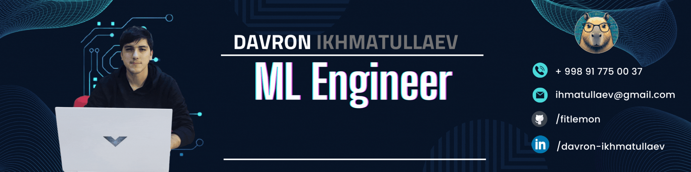
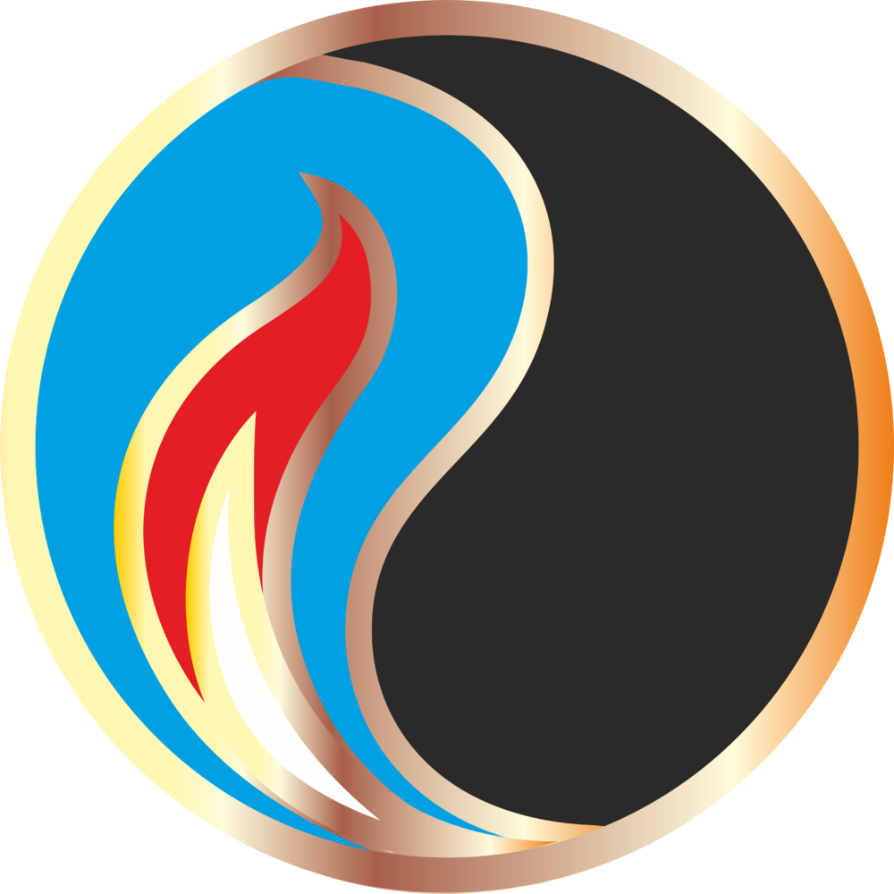
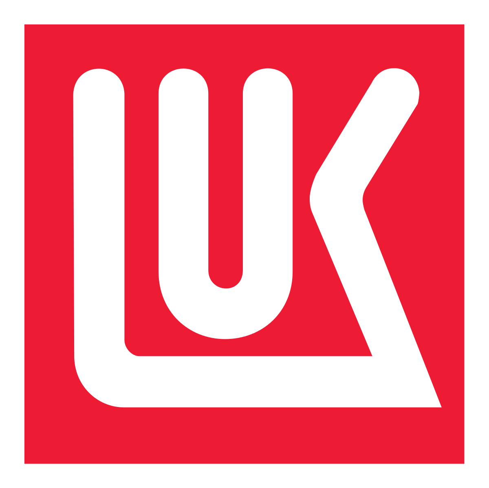
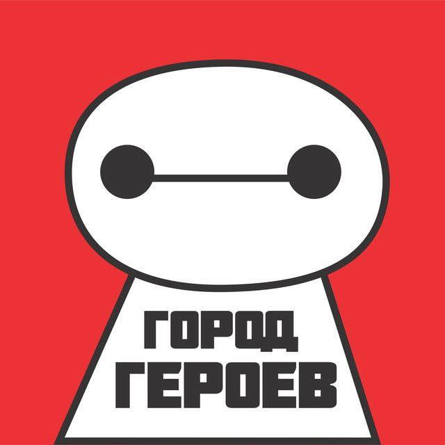

## Hi there, I am Davron 

 **ABOUT ME**
---
- 👨‍🏫 Currently pursuing a Master's in Data Science at MIPT
- 📚 I have expertise in key Python libraries and machine learning algorithms. 
- 👨‍💻 Working on the projects with CV, LLM (NLP) at AvacadaSoft and MohirAI
  

My technical skills:
 

Contacts: 
 

 
 
 

 **MY EDUCATION**
---
#### <u>Master’s Degree in Data Science</u>
 <b> Moscow Institute of Physics and Technology (MIPT), Moscow | 2023- 2025</b>

- Actively pursuing advanced knowledge in Machine Learning/Data Science through a series of intensive courses

#### <u>Bachelor’s Degree in Oil & Gas Engineering</u>
<b> RSU of Oil and Gas named after I.M.Gubkin in Tashkent city, Tashkent | 2011- 2015</b>

- Focused on the foundational and practical aspects of engineering within the oil and gas sector.

 **MY EXPERIENCE**
---
#### <u>Data Scientist</u>

 <b> MohirAI | Apr 2024 - Until now</b>
- Working on the NLP projects

#### <u>ML Engineer</u>

###### AvacadaSoft | Jan 2024 - Until now
- Working on the Face recognition project as a graduate work and corporate start-up at the same time.

#### <u>Senior Controls Systems Engineer</u>

 <b> Lukoil Uzbekistan | Jan 2020 - Until now</b>
- Responsibilities included programming controllers, maintaining databases, and managing servers, indicating a strong background in IT infrastructure, database administration, and programming.

#### <u>Owner, Curriculum developer</u>
<b> Gorod Geroev | March 2017 - February 2023</b>
- Managed a learning center specialized in Robotics and Programming, indicating leadership and administrative capabilities.
- Was responsible for developing the curriculum, education robots, and kits, showcasing skills in educational planning, technical understanding of robotics, and curriculum design.

#### <u>Software Engineer</u>

 <b>Honeywell Uzbekistan | March 2016 - March 2017</b>
- Development of Scripts and Logic (Algorithms) for Industrial Controllers and Human-Machine Interface (HMI), enhancing programming skills.
- Implement Honeywell Software products in Process Automation

 **PET PROJECTS**
---
#### <u>ChildFolio</u>

- FaceRecognition and Media-Content generation in kindergartens and schools.
 <i>#CV </i> <i>#DeepFace </i> <i>#ArcFace </i> 

#### <u>ExpertAI</u>

- LLM Chat with Retrieval-Augmented Generation (RAG), based on vendors equipment documentation.
 <i>#LangChain </i> <i>#OpenAI_API</i> <i>#RAG </i>

#### <u>AI chatbots</u>

- Advanced LLM chat bots in Telegram with easy-to-fine-tuning functionality.
 <i>#aiogram </i> <i>#OpenAI_API </i> <i>#few-shot-learning </i> <i>#fine-tuning </i>

 **LeetCode statistics**
---

 **GitHub statistics**
---
[)](https://github.com/fitlemon/github-readme-stats)
